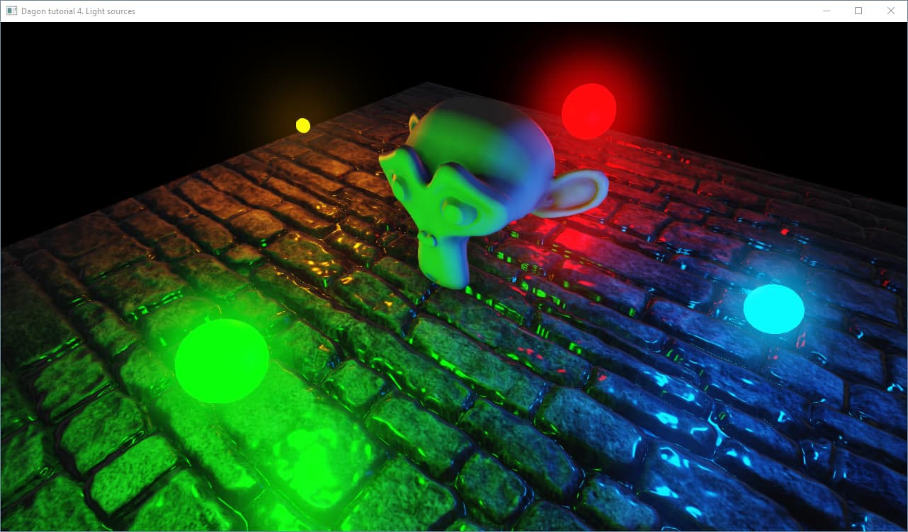

Dagon Tutorials
===============
This repository hosts sample projects for [Dagon engine](https://github.com/gecko0307/dagon/) tutorials which you can find [here](https://github.com/gecko0307/dagon/wiki/Tutorials).

1. [Simple Application](https://github.com/gecko0307/dagon/wiki/Tutorial-1.-Simple-Application)
2. [Textures](https://github.com/gecko0307/dagon/wiki/Tutorial-2.-Textures)
3. [Normal Maps](https://github.com/gecko0307/dagon/wiki/Tutorial-3.-Normal-Maps)
4. [Light Sources](https://github.com/gecko0307/dagon/wiki/Tutorial-4.-Light-Sources)
5. [Environment Maps](https://github.com/gecko0307/dagon/wiki/Tutorial-5.-Environment-Maps)
6. [PBR](https://github.com/gecko0307/dagon/wiki/Tutorial-6.-PBR)
7. [First Person Camera](https://github.com/gecko0307/dagon/wiki/Tutorial-7.-First-Person-Camera)
8. Procedural Sky
9. Post-processing
10. [Physics](https://github.com/gecko0307/dagon/wiki/Tutorial-10.-Physics)
11. [Exporting Assets from Blender](https://github.com/gecko0307/dagon/wiki/Tutorial-11.-Exporting-Assets-from-Blender)
12. [Particles](https://github.com/gecko0307/dagon/wiki/Tutorial-12.-Particles)
13. [Custom Shaders](https://github.com/gecko0307/dagon/wiki/Tutorial-13.-Custom-Shaders)
14. [Input Manager](https://github.com/gecko0307/dagon/wiki/Tutorial-14.-Input-Manager)
15. Terrain
16. Decals
17. [Character Controller](https://github.com/gecko0307/dagon/wiki/Tutorial-17.-Character-Controller)
18. [Nuklear GUI](https://github.com/gecko0307/dagon/wiki/Tutorial-18.-Nuklear-GUI)
19. 3D Sound
20. Animation
21. Ray casting
22. Vehicle Physics
23. ImGui
