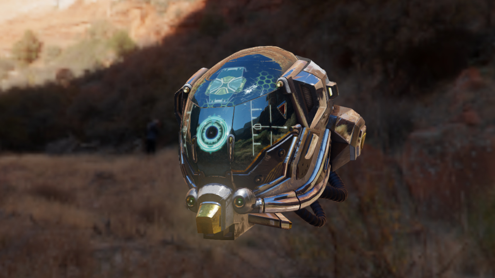

Dagon Tutorials
===============
This repository hosts sample projects for [Dagon engine](https://github.com/gecko0307/dagon/) tutorials which you can find [here](https://gecko0307.github.io/dagon/?p=tutorials).

1. [Simple Application](https://gecko0307.github.io/dagon/?p=tutorial1)
2. [Textures](https://gecko0307.github.io/dagon/?p=tutorial2)
3. [Normal Maps](https://gecko0307.github.io/dagon/?p=tutorial3)
4. [Light Sources](https://gecko0307.github.io/dagon/?p=tutorial4)
5. [Environment Maps](https://gecko0307.github.io/dagon/?p=tutorial5)
6. [PBR](https://gecko0307.github.io/dagon/?p=tutorial6)
7. [First Person Camera](https://gecko0307.github.io/dagon/?p=tutorial7)
8. Procedural Sky
9. [Post-processing](https://gecko0307.github.io/dagon/?p=tutorial9)
10. [Physics](https://gecko0307.github.io/dagon/?p=tutorial10)
11. [Exporting Assets from Blender](https://gecko0307.github.io/dagon/?p=tutorial11)
12. [Particles](https://gecko0307.github.io/dagon/?p=tutorial12)
13. [Custom Shaders](https://gecko0307.github.io/dagon/?p=tutorial13)
14. [Input Manager](https://gecko0307.github.io/dagon/?p=tutorial14)
15. [Terrain](https://gecko0307.github.io/dagon/?p=tutorial15)
16. Decals
17. [Character Controller](https://gecko0307.github.io/dagon/?p=tutorial17)
18. [Nuklear GUI](https://gecko0307.github.io/dagon/?p=tutorial18)
19. 3D Sound
20. Animation
21. Ray Casting
22. Vehicle Physics
23. ImGui
24. Environment probes
